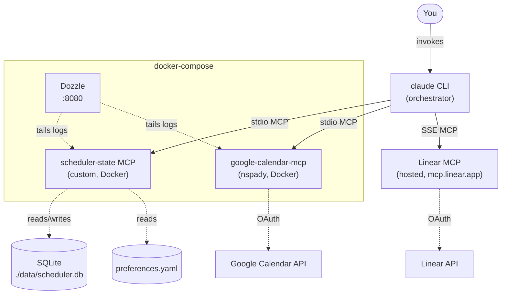

# Linear → Calendar Scheduling Agent — Hackathon Plan

A `claude`-orchestrated agent that turns Linear issues assigned to you into a sane weekly calendar, respecting existing meetings, fixed personal blocks (workouts, office hours), and your work patterns.

**Time budget:** ~4 hours of focused work for the v1 MVP. The architecture is designed so v2 (auto-sync, Slack signals) is additive, not a rewrite.

---

## Goals

**v1 (4 hours):**
1. Read Linear issues assigned to me + my Google Calendar + my preferences.
2. Generate a weekly plan that respects all three.
3. Apply the plan to my calendar with a confirmation step, recording every Linear↔Event mapping in durable state.
4. Estimate effort per issue from body + comments. Split long work into multiple sessions. Order by priority.

**v2 / stretch (post-hackathon):**
- Reactive sync — Linear status change cancels/completes the right calendar event automatically.
- Slack signal source.
- `/reschedule "<natural language>"` ad-hoc command.
- Cron-driven auto-mode.

## Non-goals (v1)

- No bidirectional sync. Calendar→Linear is out of scope.
- No multi-user. This is a single-user tool.
- No web UI. Everything is via `claude` CLI + the YAML preferences file.
- No estimation model fine-tuning. The LLM does it from issue text, no training.
- No reading external linked docs (GitHub PRs, Notion). Issue body + comments only.

---

## Architecture



**Three MCPs, one orchestrator, no custom long-running agent service.** `claude` is the agent. It composes tools from the three MCPs and runs slash commands you invoke.

### Why no separate webhook listener in v1

You proposed `eventlistener → SQLite → agent reads`. The signal log is a great pattern, but in v1 nothing is firing webhooks at it yet. The agent can pull current Linear state on every `/plan-week` invocation. The `signals` table goes in the schema from day one so v2 webhooks slot in without a migration — but no listener container is built yet.

### Why scheduler-state MCP is the centerpiece

The scheduling logic is mostly LLM judgment. The hard, irreducible state is:
- Your **preferences** (durable config).
- The **mapping table**: which Linear issue corresponds to which calendar event(s), in what order, in what status.
- The **signals** table (v1: empty; v2: webhook deliveries).
- The **plans** archive (so `/apply-plan` can re-read what `/plan-week` produced).

That's the product. Everything else is composition.

---

## Repository layout

```
hackathon-scheduler/
├── docker-compose.yml
├── .env.example
├── .env                          # gitignored
├── .mcp.json                     # claude reads this
├── CLAUDE.md                     # project context for the agent
├── README.md
├── PLANNING.md                   # this file
├── .gitignore
│
├── .claude/
│   ├── commands/
│   │   ├── plan-week.md
│   │   ├── apply-plan.md
│   │   └── reschedule.md         # stretch
│   └── skills/
│       └── scheduling/
│           └── SKILL.md          # natural-language guidance
│
├── .agent/                       # gitignored; agent scratch
│   └── last-plan.json
│
├── config/
│   ├── preferences.yaml
│   └── credentials/              # gitignored
│       ├── gcp-oauth.keys.json
│       └── google-token.json
│
├── data/                         # gitignored; SQLite volume mount
│   └── scheduler.db
│
├── services/
│   └── scheduler-state/
│       ├── Dockerfile
│       ├── package.json
│       ├── tsconfig.json
│       ├── src/
│       │   ├── index.ts          # MCP stdio entry
│       │   ├── server.ts         # tool definitions
│       │   ├── db.ts             # better-sqlite3 wrapper
│       │   ├── schema.sql
│       │   ├── prefs.ts          # YAML loader
│       │   └── tools/
│       │       ├── preferences.ts
│       │       ├── plans.ts
│       │       ├── mappings.ts
│       │       └── signals.ts
│       └── tests/
│           └── tools.test.ts
│
└── docs/
    ├── google-oauth-setup.md
    └── linear-setup.md
```

---

## scheduler-state MCP — schema and tools

### SQLite schema

```sql
-- Signals: pre-built for v2 webhooks. Empty in v1.
CREATE TABLE IF NOT EXISTS signals (
  signal_id      TEXT PRIMARY KEY,
  source         TEXT NOT NULL,        -- 'linear' | 'slack' | 'manual'
  kind           TEXT NOT NULL,        -- 'issue.updated', 'issue.created', etc.
  payload        TEXT NOT NULL,        -- JSON blob
  received_at    TIMESTAMP NOT NULL DEFAULT CURRENT_TIMESTAMP,
  processed_at   TIMESTAMP,
  resolution     TEXT
);
CREATE INDEX IF NOT EXISTS idx_signals_unprocessed
  ON signals(received_at) WHERE processed_at IS NULL;

-- Plans: each /plan-week run produces one row. /apply-plan reads the latest.
CREATE TABLE IF NOT EXISTS plans (
  plan_id        TEXT PRIMARY KEY,
  generated_at   TIMESTAMP NOT NULL DEFAULT CURRENT_TIMESTAMP,
  applied_at     TIMESTAMP,
  content        TEXT NOT NULL         -- JSON: { week_of, sessions: [...] }
);

-- Mappings: the heart of the system. Linear issue ↔ calendar event(s).
CREATE TABLE IF NOT EXISTS mappings (
  mapping_id              TEXT PRIMARY KEY,
  linear_issue_id         TEXT NOT NULL,
  linear_issue_identifier TEXT NOT NULL,    -- e.g. 'ENG-123'
  calendar_event_id       TEXT NOT NULL,
  calendar_id             TEXT NOT NULL,
  session_index           INTEGER NOT NULL, -- 1-indexed
  total_sessions          INTEGER NOT NULL,
  planned_start           TIMESTAMP NOT NULL,
  planned_end             TIMESTAMP NOT NULL,
  status                  TEXT NOT NULL,    -- 'scheduled' | 'in_progress' | 'completed' | 'cancelled'
  plan_id                 TEXT REFERENCES plans(plan_id),
  created_at              TIMESTAMP NOT NULL DEFAULT CURRENT_TIMESTAMP,
  updated_at              TIMESTAMP NOT NULL DEFAULT CURRENT_TIMESTAMP
);
CREATE INDEX IF NOT EXISTS idx_mappings_issue ON mappings(linear_issue_id);
CREATE INDEX IF NOT EXISTS idx_mappings_event ON mappings(calendar_event_id);
CREATE INDEX IF NOT EXISTS idx_mappings_active ON mappings(status)
  WHERE status IN ('scheduled', 'in_progress');
```

### MCP tools exposed

```
# Preferences
get_preferences()
  → { timezone, working_hours, defaults, fixed_blocks, calendars }

# Plans (the bridge between /plan-week and /apply-plan)
save_plan(content: object)               → { plan_id }
get_latest_plan()                        → Plan | null
mark_plan_applied(plan_id)               → void

# Mappings
record_mapping(args)                     → { mapping_id }
get_mappings_for_issue(linear_issue_id)  → Mapping[]
get_mapping_for_event(calendar_event_id) → Mapping | null
list_active_mappings()                   → Mapping[]
update_mapping_status(mapping_id, status, note?) → void
delete_mapping(mapping_id)               → void

# Signals (stubs in v1; meaningful in v2)
log_signal(source, kind, payload)        → { signal_id }
list_signals(since?, source?, processed?) → Signal[]
mark_signal_processed(signal_id, resolution?) → void
```

Implementation: TypeScript + `@modelcontextprotocol/sdk` + `better-sqlite3` + `js-yaml`. ~300 lines for v1.

---

## Preferences schema (`config/preferences.yaml`)

Keep this small in v1. Add complexity only when a use case forces it.

```yaml
timezone: America/Los_Angeles

working_hours:
  monday:    { start: "09:00", end: "18:00" }
  tuesday:   { start: "09:00", end: "18:00" }
  wednesday: { start: "09:00", end: "18:00" }
  thursday:  { start: "09:00", end: "18:00" }
  friday:    { start: "09:00", end: "18:00" }

defaults:
  session_min_minutes: 30
  session_max_minutes: 120
  break_after_minutes: 120        # take a break after 2h continuous work
  break_duration_minutes: 15
  buffer_around_meetings_minutes: 5  # don't schedule right against a meeting

fixed_blocks:
  - name: lunch
    days: [mon, tue, wed, thu, fri]
    start: "12:00"
    duration_minutes: 60
    type: block                   # block = always reserved

  - name: workout
    days: [mon, wed, fri]
    window_start: "13:00"
    window_end: "17:00"
    duration_minutes: 30
    type: flexible                # flexible = agent picks slot in window

  - name: office_hours
    days: [mon, tue, wed, thu, fri]
    start: "09:00"
    duration_minutes: 30
    type: block

calendars:
  primary_email: "you@example.com"
  agent_writes_to: "Focus Sessions"   # name of dedicated calendar
```

**Note on fixed blocks:** v1 will respect `block` types via the planning logic but won't auto-create them on the calendar. Treat recurring personal blocks (lunch, workout) as already-on-your-calendar — agent reads them via free/busy and works around. If you want agent-created fixed blocks, that's v1.5.

---

## Slash commands

### `/plan-week` — read-only

Behavior:
1. Call `get_preferences` (state MCP).
2. Call Linear MCP: list issues assigned to me, status in {Backlog, Todo, In Progress, Ready for Development}, ordered by priority.
3. For each issue, read body + comments. Estimate effort in minutes. Output reasoning per issue.
4. Call Google Calendar MCP: free/busy for next 7 weekdays on primary calendar.
5. Compose a schedule:
   - Work only in `working_hours`.
   - Avoid existing busy blocks (with `buffer_around_meetings_minutes`).
   - Respect `fixed_blocks`.
   - Sessions ≤ `session_max_minutes`. Insert breaks per `break_after_minutes`.
   - Issues > max session split into multiple sessions, scheduled in order.
   - Order priority: P1/Urgent first, then chronologically by issue priority.
6. Output a markdown plan to stdout grouped by day.
7. Call `save_plan` with structured JSON. Echo the `plan_id`.
8. **Make zero calendar writes.**

### `/apply-plan` — write

Behavior:
1. `get_latest_plan` from state MCP.
2. Render it as a confirmation diff: "Will create N events totaling H hours across D days. Approve? (yes/no)"
3. On `yes`:
   - For each session, call Google Calendar MCP `create_event` on the `agent_writes_to` calendar.
   - Event title: `[ENG-123] Issue title (1/2)` with session indicator if multi-session.
   - Event description includes Linear URL backlink and the agent's effort reasoning.
   - Call `record_mapping` for each created event.
4. Call `mark_plan_applied(plan_id)`.
5. Print summary with mapping IDs.

### `/reschedule "<instruction>"` — stretch

Free-form: "move my Tuesday afternoon block to Wednesday morning", "I'm sick today, push everything", etc. Reads `list_active_mappings`, modifies events via Calendar MCP, updates mappings.

---

## Pre-flight checklist

Five steps before the 4-hour timer starts. Don't bill these against MVP time.

1. **Google OAuth** — complete `docs/google-oauth-setup.md`. Verify with `npx @cocal/google-calendar-mcp list-calendars`.
2. **`Focus Sessions` calendar** — create in the Google Calendar UI, capture the calendar ID (not the name), put it in `config/preferences.yaml`.
3. **Linear MCP** — complete `docs/linear-setup.md`. Verify with "list my Linear teams" inside `claude`.
4. **Claude bootstraps the Linear board.** First agent action of the project. From the repo root, with this PLANNING.md present and the Linear MCP authenticated to `dustin-hack`, open `claude` and say:

   > Read the **Story tickets** section in PLANNING.md and create a Linear project named "Hackathon: Scheduler Agent" in the `dustin-hack` workspace. For each story 0–4, create a Linear issue with the title, body, and priority specified. Assign all to me. After creation, return the list of issue identifiers.

   The agent uses its own Linear MCP to set up the board it will later schedule from. Save the returned identifiers (e.g. `ENG-1` through `ENG-5`) — the meta-demo references them.

5. **(Optional) `STORIES.md`** — once tickets are created, ask the agent to drop a small index file in the repo root linking each ticket. Useful for demo lookups. Example at the end of this doc.

After pre-flight: board seeded, calendar exists, OAuth valid. **Now start the 4-hour timer.**

---

## Story tickets

The five tickets the agent creates in pre-flight step 4. Stories 0–3 are the 4-hour MVP. Story 4 is the first stretch (theme: "automation").

Each story is independently demoable. The meta-demo at the end: agent runs `/plan-week` on the *remaining* hackathon stories on this same board.

### Story 0 — Bootstrap docker-compose + scheduler-state MCP skeleton

**Estimate:** ~60 min  •  **Priority:** High

#### Body

Set up the foundational repo structure and Docker Compose stack so all three MCPs are wired into `claude` and one tool is callable from each. No business logic yet — just the rails.

#### Acceptance criteria

- [ ] `docker-compose.yml` defines services: `scheduler-state`, `google-calendar-mcp`, `dozzle`
- [ ] `docker compose up` runs cleanly with no errors
- [ ] Dozzle accessible at `http://localhost:8080` showing logs from both MCP services
- [ ] `.mcp.json` registers all three MCPs (Linear hosted SSE + google-calendar Docker + scheduler-state Docker)
- [ ] `claude mcp list` shows all three connected
- [ ] scheduler-state MCP exposes a `health_check` tool returning `{ ok: true, db_path, prefs_loaded }`
- [ ] SQLite schema applied on container boot (idempotent `CREATE TABLE IF NOT EXISTS`); `signals`, `plans`, `mappings` tables present
- [ ] `./data/scheduler.db` exists on host and is writable by the container (volume mount)
- [ ] `config/preferences.yaml` seeded with starter values including timezone, working hours, and `Focus Sessions` calendar ID
- [ ] `README.md` documents `make up` / `make down` (or equivalent)
- [ ] `.gitignore` excludes `data/`, `config/credentials/`, `.agent/`, `.env`

#### Verification

From inside `claude`:
```
> Use the health_check tool from scheduler-state
> List my Google calendars
> List my Linear teams
```
All three return real data.

```bash
sqlite3 data/scheduler.db ".tables"
# expect: mappings  plans  signals
```

#### Technical notes

- **scheduler-state stack:** TypeScript + `@modelcontextprotocol/sdk` + `better-sqlite3` + `js-yaml`. Stdio transport.
- **google-calendar-mcp:** use `ghcr.io/metorial/mcp-container--nspady--google-calendar-mcp--google-calendar-mcp` OR build `nspady/google-calendar-mcp` from source.
- **Linear MCP:** SSE at `https://mcp.linear.app/sse` — no container.
- Mount `./data/` and `./config/` as volumes.
- The `Focus Sessions` calendar must be created manually before this story is done.

#### Dependencies

Pre-flight steps 1–3 complete.

---

### Story 1 — `/plan-week` command (read-only)

**Estimate:** ~75 min  •  **Priority:** High

#### Body

Implement the `/plan-week` slash command. Reads Linear issues, calendar free/busy, and preferences. Generates a weekly plan respecting working hours and existing meetings. Saves to durable storage. **Does not write to calendar.**

#### Acceptance criteria

- [ ] scheduler-state MCP exposes: `get_preferences`, `save_plan`, `get_latest_plan`
- [ ] `.claude/commands/plan-week.md` defines the command with clear instructions
- [ ] Command flow:
  - [ ] Calls `get_preferences`
  - [ ] Calls Linear MCP to list issues assigned to me on the hackathon board, ordered by priority
  - [ ] Calls Google Calendar MCP free/busy for next 7 weekdays on primary calendar
  - [ ] Composes per-day schedule respecting: working hours, fixed blocks, existing meetings, buffer time
- [ ] Output:
  - [ ] Markdown plan to stdout grouped by weekday with start/end times
  - [ ] One line of estimate reasoning per issue
  - [ ] `plan_id` printed at end
- [ ] Plan saved to scheduler-state via `save_plan`
- [ ] **Zero calendar writes** — verify with calendar diff before/after

#### Verification

```bash
# Before
# (note current events on primary calendar for the next 7 days)

claude /plan-week
# observe markdown plan output

# After
# Same set of events on primary calendar — no events created

sqlite3 data/scheduler.db "SELECT plan_id, generated_at FROM plans ORDER BY generated_at DESC LIMIT 1"
# returns the new plan
```

Manual check: no scheduled work in the proposed plan overlaps with any existing event.

#### Technical notes

- Slash command markdown should orient Claude: "you are planning a focused work week. Read all three sources before composing. Output reasoning per issue."
- Linear team filter goes in CLAUDE.md project-level guidance OR hardcoded in the command prompt.
- Estimation in v1 is pure LLM judgment from issue text — no model, no fancy logic.

#### Dependencies

Story 0 complete.

---

### Story 2 — `/apply-plan` command (write)

**Estimate:** ~60 min  •  **Priority:** High

#### Body

Implement the `/apply-plan` slash command. Reads the latest saved plan, prompts for confirmation, creates calendar events on the dedicated `Focus Sessions` calendar, and records every Linear-issue ↔ calendar-event mapping in durable state.

#### Acceptance criteria

- [ ] scheduler-state MCP exposes: `record_mapping`, `mark_plan_applied`, `list_active_mappings`
- [ ] `.claude/commands/apply-plan.md` defines the command
- [ ] Command flow:
  - [ ] Calls `get_latest_plan`
  - [ ] Renders confirmation summary: total events, total hours, days affected, plan generation timestamp
  - [ ] Warns if plan was generated > 1 hour ago
  - [ ] Waits for explicit "yes" confirmation
  - [ ] On confirm, creates one calendar event per session via Google Calendar MCP on `Focus Sessions`
  - [ ] Event title format: `[ENG-123] Issue title (1/2)` — session indicator only when total_sessions > 1
  - [ ] Event description includes: full Linear URL, agent's effort estimate, reasoning
  - [ ] Each created event recorded as a row in `mappings` with `status='scheduled'`, `plan_id` set
  - [ ] Calls `mark_plan_applied(plan_id)` after writes succeed
- [ ] On rejection: no events, no DB writes

#### Verification

```bash
claude /plan-week
claude /apply-plan
# answer "yes"
```

- Open Google Calendar UI → events on `Focus Sessions`.
- Click event → description shows Linear URL → click takes you to the right issue.
- ```bash
  sqlite3 data/scheduler.db \
    "SELECT linear_issue_identifier, session_index, total_sessions, status, plan_id FROM mappings"
  ```
  One row per event, all `status='scheduled'`, all sharing the same `plan_id`.

Reject path: re-run, answer "no" — no calendar changes, no new mapping rows.

#### Technical notes

- Suggested event description format:
  ```
  [Linear: ENG-123](https://linear.app/dustin-hack/issue/ENG-123)

  **Estimate:** 90min (1 of 2 sessions)
  **Reasoning:** Body describes adding validation + 3 unit tests. Mid-complexity.
  ```
- Failure mid-batch: leave already-created events alone, do NOT call `mark_plan_applied`. Plan can be retried after orphan cleanup. Document this in README.

#### Dependencies

Story 1 complete. `Focus Sessions` calendar ID in `preferences.yaml`.

---

### Story 3 — Estimation, chunking, priority sequencing

**Estimate:** ~45 min  •  **Priority:** High

#### Body

Refine `/plan-week` to produce smarter plans: estimate effort from issue body + comments, split long tasks into multiple sessions, sequence by priority.

#### Acceptance criteria

- [ ] For each Linear issue, agent reads body + comments before estimating
- [ ] Estimate reasoning included in markdown plan output and structured plan JSON
- [ ] Issues > `session_max_minutes` (default 120) split into N sequential sessions
- [ ] Multi-session issues display indicators in event titles (`(1/2)`, `(2/2)`)
- [ ] Linear `priority` field affects ordering: Urgent/P1 first, then P2, P3, P4
- [ ] Equal-priority ties break by issue creation date (older first)
- [ ] Breaks per `break_after_minutes` respected between consecutive sessions on the same day

#### Verification

Throwaway test fixtures on the board:

1. **Multi-session test:** ticket "Add three new endpoints with tests" with body describing ~3 hours. Expected: 2 sessions (e.g. 2h + 1h). Verify:
   ```bash
   sqlite3 data/scheduler.db \
     "SELECT linear_issue_identifier, session_index, total_sessions FROM mappings WHERE linear_issue_identifier='<ticket>' ORDER BY session_index"
   ```
2. **Priority test:** two ~2h tickets, P1 and P3. P1 lands earlier in the week.
3. **Break test:** day with back-to-back sessions exceeding `break_after_minutes` shows a break gap.

#### Technical notes

- Reading body + comments means calling Linear's `get_issue` (or equivalent) with comment expansion, not just `list_issues`.
- Heuristic for chunking: if estimate > `session_max_minutes`, split into `ceil(estimate / session_max_minutes)` equal-ish sessions, scheduled sequentially with breaks.
- Breaks don't need calendar events — just leave the gap.

#### Dependencies

Stories 1 + 2 complete.

---

### Story 4 — [STRETCH 🎯] Webhook-driven auto-scheduling

**Estimate:** ~120 min  •  **Priority:** Medium *(do this if v1 lands with time to spare)*

#### Body

**Hackathon theme story: "automation."** Linear webhook fires when an issue is assigned to me or moved into "Ready for Development" → calendar updates within seconds, no manual `claude` invocation. Closing demo of the hackathon.

#### Acceptance criteria

- [ ] New `linear-webhook-listener` service in `docker-compose.yml`
  - [ ] Receives POST at `/webhooks/linear`
  - [ ] Verifies Linear signing secret
  - [ ] Calls `log_signal(source='linear', kind=<event>, payload=<full payload>)` on scheduler-state
  - [ ] Returns 200 immediately
- [ ] Tunnel for development documented in README (ngrok or smee.io)
- [ ] Linear webhook configured in `dustin-hack` workspace pointing at the tunnel
- [ ] scheduler-state MCP exposes: `list_signals(processed=false)`, `mark_signal_processed`
- [ ] `.claude/commands/process-signals.md` defines a command that:
  - [ ] Reads unprocessed signals
  - [ ] For each `issue.updated` signal:
    - State ≥ "Ready for Development" with no existing mapping → schedule (single-issue plan + apply)
    - State = "Done" → mark mapping(s) `completed`; mark calendar event accordingly
    - State = "Cancelled" or back to "Backlog" → cancel future calendar events; mark mapping(s) `cancelled`
  - [ ] Marks each signal processed with a resolution note
- [ ] Listener invokes `claude -p '/process-signals' --dangerously-skip-permissions` after writing each signal (or use cron fallback)

#### Verification

End-to-end demo path:

1. Empty `Focus Sessions` calendar.
2. Linear UI: create urgent ticket assigned to me, body "Fix the login bug, ~30 min." Move to "Ready for Development."
3. **Within 30s:** event appears on `Focus Sessions` at next available slot.
4. Move to "Done."
5. **Within 30s:** event marked complete (or removed).
6. ```bash
   sqlite3 data/scheduler.db \
     "SELECT signal_id, kind, processed_at, resolution FROM signals ORDER BY received_at"
   ```
   Each signal has `processed_at` and a resolution note.

#### Technical notes

- **Headless `claude`:** `claude -p '<prompt>' --dangerously-skip-permissions --output-format json` reads `.mcp.json` from cwd. Listener container needs the repo mounted and `claude` CLI installed.
- **Tunnel:** ngrok if you have an account; smee.io is a free fallback.
- **Cron fallback:** if headless invocation flakes during the hackathon, run `claude /process-signals` from a `cron` container every 60s. Listener still writes signals — only the drain mechanism changes.
- **Race condition:** two close-together signals could overlap two `/process-signals` runs. Mitigate with SQLite advisory lock OR strictly serial single-invocation processing.

#### Dependencies

Stories 0–3 complete. Personal Linear API key (already in hand) for webhook signing secret.

---

### Buffer / demo prep *(remaining time)*

- README polish.
- Verify the meta-demo: `/plan-week` against remaining open stories on the board lands them on the calendar.
- Record a 60-second demo screencap.

---

## STORIES.md template (optional, post-bootstrap)

After pre-flight step 4, ask the agent to create this file in the repo root:

```markdown
# Hackathon Stories

Tracking board: https://linear.app/dustin-hack/projects/all

| ID | Status | Title |
|---|---|---|
| ENG-1 | Backlog | Bootstrap docker-compose + scheduler-state MCP skeleton |
| ENG-2 | Backlog | /plan-week command (read-only) |
| ENG-3 | Backlog | /apply-plan command |
| ENG-4 | Backlog | Estimation, chunking, priority |
| ENG-5 | Backlog | [STRETCH] Webhook-driven auto-scheduling |
```

The agent can be told (in CLAUDE.md) that this file is a fast lookup index, not the source of truth — Linear is the source of truth.

---

## Stretch goals (post 4-hour mark)

Ordered by hackathon-theme alignment (theme: **automation**), then effort.

1. **🎯 Webhook-driven auto-scheduling** — see **Story 4** above for full ticket. First stretch, theme story, closing demo.
2. **`/reschedule "<instruction>"`** *(~45 min)* — natural-language ad-hoc moves. Reads `list_active_mappings`, calls Calendar MCP to move events, updates mappings.
3. **Slack signal source** *(~45 min once webhook stretch is done)* — same shape as Linear listener; different parser. Triggers ad-hoc work like "@bot block 30min for code review tomorrow."
4. **Auto-mode (cron fallback)** *(~20 min)* — backup if the headless `claude` invocation pattern is flaky: a `cron` container runs `claude /process-signals` every 60s instead of the listener invoking it directly.
5. **Read linked GitHub PRs / Notion docs** *(~60 min)* — richer estimation context. Adds two more MCPs and extra tool calls per issue.

### Demo arc (with webhook stretch)

1. **Start state:** empty `Focus Sessions` calendar, hackathon stories in Backlog on the `dustin-hack` board.
2. Run `claude /plan-week` → review the proposed plan in stdout. Run `/apply-plan` → calendar fills with the week's sessions.
3. **Theme moment:** in the Linear UI, drag a new urgent ticket into "Ready for Development." Within 30 seconds, the calendar updates without touching `claude`.
4. Move a ticket to "Done" → its calendar event clears.
5. **Closer:** all of this has been the agent managing its own remaining hackathon stories on the same board.

---

## Risks and mitigations

| Risk | Mitigation |
|---|---|
| **Google OAuth eats your timebox.** This is the #1 v1 risk by a wide margin. | Do it the night before. The setup doc walks through it end-to-end. Test `npx @cocal/google-calendar-mcp auth` works before hackathon day. |
| **Test-mode tokens expire after 7 days.** | Fine for a hackathon. Document the re-auth command in README. |
| **Linear MCP OAuth flow** interrupts demo. | Pre-authenticate. Verify session is valid right before demo. |
| **Agent over-estimates / under-estimates.** | v1 prints reasoning; you eyeball it. Build trust before relying on it. |
| **Calendar pollution from failed runs.** | Dedicated `Focus Sessions` calendar makes "delete all and retry" a one-click action. |
| **No undo on `/apply-plan`.** | Confirmation prompt is the firewall. Stretch: `/undo-plan` reads mappings with `plan_id=$latest` and deletes events. |
| **Plan stale between commands.** | `last-plan.json` written to disk + DB row. `/apply-plan` shows generated-at timestamp; warn if > 1 hour old. |

---

## Locked decisions

| Decision | Value |
|---|---|
| Linear MCP path | **Hosted** (`mcp.linear.app/sse`, OAuth) |
| Linear workspace | `dustin-hack` — see https://linear.app/dustin-hack/projects/all |
| Calendar target | Dedicated `Focus Sessions` calendar |
| Estimation context (v1) | Linear issue body + comments only |
| Estimation context (later stretch) | + linked GitHub PRs / Notion docs |
| Timezone | `America/Los_Angeles` |
| v1 invocation | `claude` CLI manual invocation only |
| **First stretch goal** | **Webhook-driven auto-scheduling** (hackathon theme: "automation") |

The personal Linear API key you already have on hand is reserved for the webhook stretch (signing-secret verification + any direct API calls outside the MCP path).
