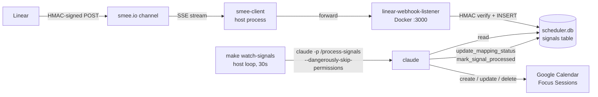

# Linear Auto-Scheduler

A `claude`-orchestrated agent that turns Linear issues assigned to you into a sane weekly calendar — respecting existing meetings, fixed personal blocks, and your work patterns.

**Stack:** three MCPs, one orchestrator, no custom long-running agent service.

- **Linear MCP** (hosted SSE, `mcp.linear.app/sse`) — read issues, statuses, priorities
- **google-calendar MCP** (`nspady/google-calendar-mcp` in Docker) — free/busy + create events
- **scheduler-state MCP** (custom, this repo, Docker) — SQLite-backed durable state for plans, mappings, signals; YAML preferences loader

`claude` is the agent. It composes tools from the three MCPs and runs slash commands in `.claude/commands/`.

See [`PLANNING.md`](./PLANNING.md) for goals, schemas, story tickets, and roadmap.

---

## Quickstart

### 1. Pre-flight (one-time, ~30 min)

Do these **before** running the agent. They're the timebox risk during the hackathon.

1. **Google OAuth** — follow [`docs/google-oauth-setup.md`](./docs/google-oauth-setup.md). End state: `config/credentials/gcp-oauth.keys.json` + `config/credentials/google-token.json`, both populated.
2. **Focus Sessions calendar** — create in Google Calendar UI, capture the calendar ID, set `calendars.agent_writes_to` in `config/preferences.yaml`.
3. **Linear MCP** — follow [`docs/linear-setup.md`](./docs/linear-setup.md). End state: `claude /mcp` shows Linear authenticated.
4. **Bootstrap the Linear board** — see [`PLANNING.md`](./PLANNING.md) §"Pre-flight checklist" step 4. Claude creates project + 5 stories in `dustin-hack`.

### 2. Run

```bash
cp .env.example .env                                           # fill in any needed values
cp config/preferences.example.yaml config/preferences.yaml     # then edit primary_email + agent_writes_to

make build                  # build scheduler-state image
make up                     # start dozzle (log viewer at http://localhost:8080)
make mcp-list               # claude mcp list — verify MCPs connected
```

**Expected `mcp list` state during pre-flight:**

| MCP | Green when… |
|---|---|
| `scheduler-state` | Image built (`make build` succeeded) — green from day one |
| `google-calendar` | OAuth done AND `config/credentials/google-token.json` exists |
| `linear` | `claude /mcp` flow completed in a session (one-time browser auth) |

If `google-calendar` fails before OAuth: that's expected. Pre-flight gates it.

Then inside `claude`:

```
> use the health_check tool from scheduler-state
> /plan-week
> /apply-plan
```

### 3. Inspect state

```bash
make db-tables              # show: signals  plans  mappings
make db-shell               # interactive sqlite3
```

---

## Smoke-testing MCP handlers

Pipe a JSON-RPC request file into a service's stdin via the `make rpc` wrapper:

```bash
cat <<'EOF' > /tmp/rpc.txt
{"jsonrpc":"2.0","id":1,"method":"initialize","params":{"protocolVersion":"2024-11-05","clientInfo":{"name":"smoke","version":"0"},"capabilities":{}}}
{"jsonrpc":"2.0","method":"notifications/initialized"}
{"jsonrpc":"2.0","id":2,"method":"tools/call","params":{"name":"get_preferences","arguments":{}}}
EOF
make rpc SVC=scheduler-state FILE=/tmp/rpc.txt
```

The wrapper runs `docker compose run --rm -T <SVC>` under a `perl alarm` watchdog (portable across macOS + Linux without requiring `brew install coreutils`). After `RPC_TIMEOUT` seconds (default 5) the docker CLI is killed, the container exits, and `--rm` removes it. **Without the watchdog**, stdio MCP servers that don't exit on stdin EOF leak `*-run-*` containers (DUS-12 root cause).

If you ever notice leaked containers anyway: `make clean-orphans` sweeps any `linear-auto-scheduler-*-run-*` containers.

---

## Repo layout

See [`PLANNING.md`](./PLANNING.md) §"Repository layout".

---

## Troubleshooting

- **OAuth token expired (7-day test mode):** re-run `npx @cocal/google-calendar-mcp auth` per `docs/google-oauth-setup.md`.
- **`claude mcp list` shows scheduler-state failed:** `make rebuild`, then `make rpc SVC=scheduler-state FILE=/tmp/rpc.txt` to see boot errors on stderr without leaving an orphan container behind.
- **`better-sqlite3` build fails:** Alpine needs `python3 make g++` in the builder stage — already in the Dockerfile. If it still flakes, switch the base image to `node:20` (debian).
- **SQLite locked:** WAL mode is enabled, but if you have a stale `claude` process holding it, `make down && make up`.

---

## Webhook-driven auto-scheduling (DUS-9)

Linear webhook → calendar update within ~30s, no manual `claude` invocation. Two cooperating processes:



The listener does not invoke `claude` itself. The decoupling keeps the listener container minimal (no `claude` CLI, no host config mounts, ~6 ms response latency) and the polling loop trivially serializable.

### One-time setup

1. **Create a Smee channel.** Visit https://smee.io/new — copy the channel URL.
2. **Create the Linear webhook.** Linear UI → Settings → API → Webhooks → New webhook:
   - URL: the Smee channel URL from step 1.
   - Resource types: **Issues** (minimum). Add **Comments** later if you want comment-thread re-estimation.
   - Team: **Dustin-Hack** (or workspace-wide).
   - Copy the signing secret Linear displays.
3. **Populate `.env`:**
   ```bash
   LINEAR_WEBHOOK_SECRET=<paste-from-linear>
   SMEE_URL=<paste-smee-channel-url>
   ```
4. **Build the listener image:** `make build-listener`.

### Run the pipeline (three terminals)

```bash
# Terminal 1 — start listener container
make webhook-up

# Terminal 2 — forward Smee → localhost:3000 (HMAC verification still happens locally)
make smee-forward

# Terminal 3 — drain loop. Hits the calendar safety carve-out: writes events
# without an interactive `yes` prompt. Triggered only by HMAC-verified signals.
make watch-signals
```

Stop with Ctrl-C in each. `make webhook-down` stops the listener container.

### Verifying the round-trip

1. Drag a Linear ticket on the `dustin-hack` board to **Ready for Development**.
2. Within ~30s, an event appears on the **Focus Sessions** calendar at the next available slot.
3. Inspect the signal:
   ```bash
   sqlite3 data/scheduler.db \
     "SELECT signal_id, kind, processed_at, resolution FROM signals ORDER BY received_at DESC LIMIT 5"
   ```
   The most recent row has `processed_at` set and a resolution like `scheduled:1:2026-05-07T10:00:00…`.

### Calendar-safety carve-out

The webhook drain (`make watch-signals` → `claude -p '/process-signals' --dangerously-skip-permissions`) is the **only** path that writes calendar events without interactive confirmation. The firewall is two layers thick:

- **Listener** rejects any POST without a valid HMAC-SHA256 signature (401).
- **Slash command** schedules only when no active mapping exists, cancels only future events, only on the `Focus Sessions` calendar.

Authorized for DUS-9 specifically. All other calendar writes (`/apply-plan`) still go through interactive confirmation.

---

## Status

Pre-hackathon scaffold. Story 0 is mostly satisfied by the scaffold itself. Stories 1–4 implementation begins after the 4-hour timer starts.
