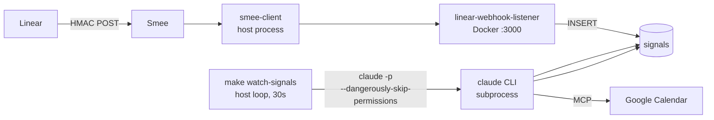
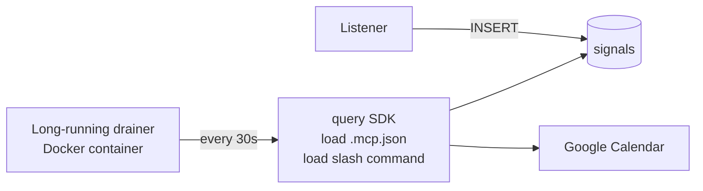
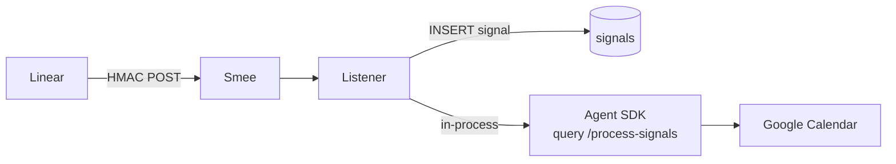

# Migrating the drain to the Claude Agent SDK

A design note. Captures the v2 path for replacing `make watch-signals` (host-loop CLI) with the [Claude Agent SDK](https://docs.anthropic.com/en/api/agent-sdk/overview), the tradeoffs, and what it would change.

**Status:** Not built. v1 ships on the `claude` CLI. This doc exists so the next maintainer doesn't have to re-derive the analysis.

---

## What v1 looks like today

- Listener is HMAC + INSERT + 200. No `claude` inside the container.
- Drain is a host shell loop spawning `claude -p '/process-signals'` every 30 s.
- Auth lives in `~/.claude/` (interactive OAuth, populated once on the dev machine).
- Slash command lives in `.claude/commands/process-signals.md`. Loaded by the CLI at invocation time.
- MCP servers come from `.mcp.json` in cwd. CLI auto-discovers.

The CLI is the agent host. We orchestrate via a polling Makefile target.

---

## What v2 with the Agent SDK would look like

Two viable shapes, ordered by intrusiveness.

### Shape A — keep the polling loop, swap CLI for SDK

A small Node service replaces `make watch-signals`. On each tick it calls `query({ prompt: '/process-signals', options: { permissionMode: 'bypassPermissions', mcpConfig: '.mcp.json', slashCommandsPath: '.claude/commands' } })`. Output captured as a structured stream instead of stdout-scraped JSON.

### Shape B — listener fires drain directly, no polling

The listener becomes the agent host: HMAC verify, INSERT, immediately call `query()` against the just-written signal, return 200 once the SDK has acknowledged the run (or fire-and-forget). Latency drops from ≤30 s to seconds.

Shape B is the "true automation" form. Shape A is a refactor with no behavior change.

---

## Arguments for switching

### 1. Drop polling latency

Worst-case demo latency today is `30 s` (one full poll interval). Median is ~15 s. Shape B drops worst-case to ~`first-token` (1–3 s) plus dispatch.

### 2. Structured output instead of stdout scraping

CLI `--output-format json` gives a single envelope at the end of the run. SDK streams `AssistantMessage`/`ToolUseBlock`/`ResultMessage` objects in real time. Lets the listener:

- Surface `ToolUseBlock` calls (e.g. `create-event`) as structured log lines for Dozzle.
- Pipe per-signal resolution back to the listener's response body before the loop exits.
- Hook custom callbacks on tool calls — e.g. emit a Slack notification when a `delete-event` fires.

The CLI path can do none of these without parsing scraped logs.

### 3. Per-call permission control

CLI has one knob: `--dangerously-skip-permissions` on or off, all-or-nothing for the whole invocation. SDK exposes `canUseTool` callbacks per tool. We could allow `record_mapping` and `mark_signal_processed` automatically while still requiring confirmation for `create-event` *if* the source signal is from an unfamiliar kind. Tighter firewall around the calendar carve-out without losing the automation property.

### 4. Multi-turn drain

If a signal needs follow-up (e.g. "this issue has 3 hours of work, but only 1 hour fits today; ask the user where to put the rest"), the SDK's `resume`/`continue` lets the drainer pause, surface a question, and pick up later. CLI is one-shot.

### 5. Programmatic prompt-cache instrumentation

SDK exposes `usage.cache_read_input_tokens` per turn. Cache hit rate over time is a real metric for "is the slash command stable enough to be a daily driver." CLI doesn't surface this.

---

## Arguments against switching

### 1. Auth model gets uglier inside Docker

The CLI uses `~/.claude` interactive OAuth, set up once on the dev machine. The SDK in a container needs `ANTHROPIC_API_KEY` (or programmatic OAuth via Bedrock/Vertex). New env var, new key, new place to leak the key from. Shape B in particular re-introduces the `claude`-in-container problem we deliberately ducked: auth credentials, `.mcp.json`, and the docker socket all need to mount cleanly.

### 2. New billing surface

CLI calls reuse the user's Claude subscription. SDK calls bill against an API key. For a hackathon demo this is rounding error; for a daily-running drainer it adds up — every poll tick spends tokens on the system prompt + tool listings even if there are zero unprocessed signals.

Mitigation: only invoke when `list_signals(processed=false)` returns non-empty. (Already true for the SDK shape but worth calling out — naive ports waste money.)

### 3. Slash-command compatibility is not free

`claude -p '/<command>'` is documented and stable. The SDK's slash-command loading API is newer and the contract for "load `.claude/commands/*.md` and invoke by name" is less battle-tested. Risk of behavior drift between CLI and SDK execution of the same markdown file (different tool-result rendering, different system-prompt injection, etc.).

Mitigation: pin SDK version; integration test the slash command both ways during the migration.

### 4. New dependency, new failure modes

`@anthropic-ai/claude-agent-sdk` is one more package. Version drift, transitive dependency resolution, type churn between SDK majors. The CLI is a single binary already on the dev machine.

### 5. Lost the simple-Makefile recovery property

Today, "drain is wedged" is fixable by Ctrl-C in the `make watch-signals` terminal and `rmdir /tmp/lin-sched-watch.lock`. A long-running drainer process or a listener-spawn flow needs container restart, log inspection, possibly an SDK-internal session reset. More moving parts to debug at 11 PM the night before the demo.

### 6. Slash-command files become non-portable

If we author the slash command for SDK semantics (custom callbacks, structured output expectations), the same file no longer runs cleanly with `claude /process-signals` from a terminal. Today the file is interactive-and-headless dual-purpose. Locking ourselves to the SDK closes that door.

---

## Recommendation

**Do not migrate during the hackathon timebox.** v1's CLI-based drain ships and is reliable. The arguments-for are real but cumulative — each one is "nice to have," none are "demo will fail without."

**Migrate post-hackathon if** any of the following triggers fire:

| Trigger | Shape |
|---|---|
| Demo audience asks for sub-second auto-scheduling | Shape B |
| Need per-tool permission firewall around `create-event` | Shape A first, then Shape B |
| Want to pipe drainer output to Slack/Dozzle live | Shape A |
| Drainer becomes a daily driver and we want cache-hit telemetry | Shape A |
| Multi-turn drains land (e.g. confirm-where-to-place-overflow) | Shape B |

If only one trigger fires, Shape A is enough. Shape B is justified only when the listener-spawn auth/cred mounting work pays for itself in latency — i.e. when the polling-interval ceiling becomes a UX problem, not a theoretical one.

---

## Migration checklist (when the time comes)

- [ ] Add `@anthropic-ai/claude-agent-sdk` to `services/linear-webhook-listener/package.json` (Shape B) or a new `services/signal-drainer/` (Shape A).
- [ ] Provision `ANTHROPIC_API_KEY` (gitignored env var). Update `.env.example`.
- [ ] Mount `.mcp.json` and `.claude/commands/` into the drainer container.
- [ ] Mount `/var/run/docker.sock` if MCP servers are themselves docker-spawned (Shape B specifically).
- [ ] Replace `make watch-signals` invocation. Keep the target as a fallback for one release for safe rollback.
- [ ] Write integration tests that run the same slash-command markdown via both CLI and SDK against a fixture signal payload; assert resolution strings match.
- [ ] Document the new auth model in README §"Webhook-driven auto-scheduling".
- [ ] Update `CLAUDE.md` calendar-safety section: confirm the carve-out's two-layer firewall (HMAC at listener, dispatch guards in slash command) still holds under the new permission model.
