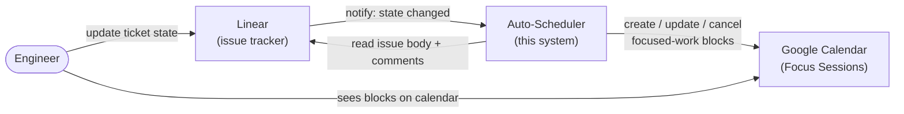
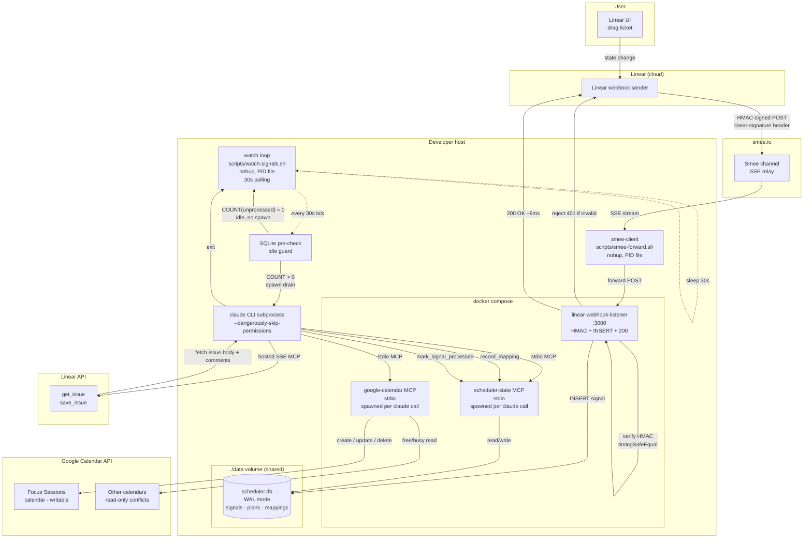
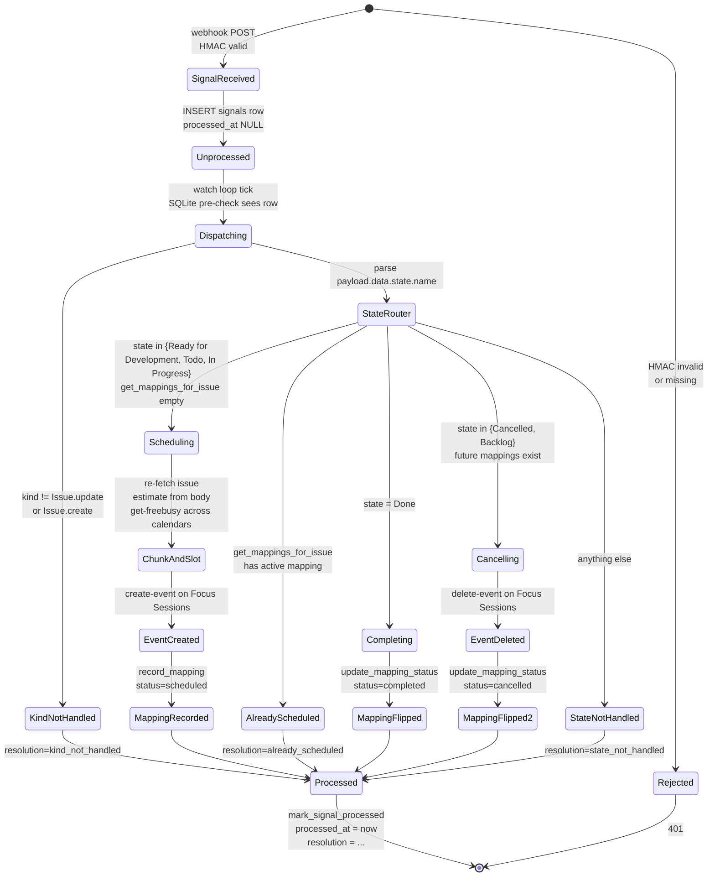

# Architecture & Flow Diagrams

Three views of the webhook-driven auto-scheduling pipeline (DUS-9), zooming in:

1. **Executive summary** — four actors, the value loop, no implementation detail.
2. **Topology** — every process, where data flows, what crosses the network.
3. **Per-signal state machine** — the dispatch logic inside `/process-signals` once a signal lands in SQLite.

For the lifecycle commands (`/scheduler-up` / `/scheduler-down`) and the demo runbook, see [`demo-runbook.md`](./demo-runbook.md). For the v2 SDK migration analysis, see [`agent-sdk-migration.md`](./agent-sdk-migration.md).

---

## 1. Executive summary

The user manages tickets in Linear and lives on Google Calendar. The Auto-Scheduler is the bridge: when ticket state changes, focused-work time appears (or disappears) on the calendar without manual planning.

### What each actor owns

| Actor | Owns | Doesn't own |
|---|---|---|
| **Engineer** | Ticket state in Linear; the act of doing the work | Calendar arrangement (delegates to Auto-Scheduler) |
| **Linear** | Source of truth for issue state, priority, body, comments | Time and scheduling |
| **Auto-Scheduler** | When and how long each focused-work block sits on the calendar; the issue ↔ event mapping | Issue content (read-only); calendar UX |
| **Google Calendar** | Source of truth for time conflicts (existing meetings) and the rendered focused-work blocks | Issue context |

### The value loop

1. Engineer drags a ticket from "Backlog" to "Ready for Development." That's the only manual action.
2. Auto-Scheduler hears about it, reads the issue, finds an open slot on the calendar that respects working hours, fixed blocks, and existing meetings across all calendars the user belongs to.
3. A block appears on Focus Sessions with the issue title, Linear backlink, and the agent's reasoning for the estimate.
4. Engineer drags the same ticket to "Done" → the block stays as history. To "Cancelled" → future block vanishes. To "Backlog" → same.

No `claude` invocation, no terminal commands, no spreadsheet. The engineer's calendar reflects their Linear board automatically.

---

## 2. Topology

End-to-end view of one webhook delivery, from Linear UI drag to calendar event creation. Boxes that share the same enclosing subgraph live in the same trust domain or process boundary.

### Notes

- **HMAC firewall.** The `linear-signature` header is verified on the raw body inside the listener with `timingSafeEqual` and a length-pre-check. Any unsigned or wrongly-signed POST returns 401 without touching SQLite.
- **Two-writer SQLite.** The listener and scheduler-state both open WAL connections to the same `scheduler.db` file. WAL mode handles concurrent writers; the listener only inserts signals, scheduler-state owns reads and all mapping/plan writes.
- **Listener does not invoke `claude`.** The drain runs on the host as a polling loop (cron-fallback path from the DUS-9 AC). Trade-offs are captured in [`agent-sdk-migration.md`](./agent-sdk-migration.md).
- **Calendar safety carve-out.** The `claude -p '/process-signals' --dangerously-skip-permissions` invocation is the only path that writes calendar events without an interactive `yes`. The firewall is two layers thick — HMAC verification at the listener plus the dispatch guards in the slash command (next diagram).

---

## 3. Per-signal state machine

What `/process-signals` does once it picks up an unprocessed signal. Every terminal state ends in `mark_signal_processed`, even no-ops, so signals never re-drain.

### Notes

- **Idempotency guard.** Linear emits multiple `Issue.update` events per UI drag (state, sortOrder, startedAt all change). The first signal lands `Scheduling`; the second sees an active mapping and lands `AlreadyScheduled`. Resolution strings make this visible in the audit log: `scheduled:1:<ts>` followed by `already_scheduled`.
- **Done preserves history.** `Done` only flips the mapping status; the calendar event stays. This is deliberate — "I completed this work" should leave an audit trail of when the focused-work block actually happened.
- **Cancelled deletes only future events.** Past-dated mappings (sessions that already happened) stay in the calendar even when the issue is cancelled, for the same audit-trail reason.
- **No-op resolutions still mark processed.** Comments, project events, malformed payloads — everything gets `mark_signal_processed` with a descriptive resolution so the drain doesn't loop on signals that will never be actionable.
- **Atomic guard on `mark_signal_processed`.** SQL `UPDATE ... WHERE processed_at IS NULL` mirrors the `mark_plan_applied` pattern. Two overlapping drains can't both claim the same signal — second invocation throws and the slash command surfaces it as `error:already_processed` rather than silently overwriting the resolution.

---

## How the two diagrams compose

The topology shows what's running and where the bytes go. The state machine shows what each signal *means* once it lands.

A single drag in Linear typically produces:

- **2 webhook deliveries** (state change + sortOrder change → 2 `Issue.update` events).
- **2 signal rows** in SQLite.
- **1 active mapping change** (the second signal idempotency-guards into `AlreadyScheduled`).
- **1 calendar mutation** (create / update / delete on Focus Sessions, depending on the new state).

That ratio is the audit signature of the system working correctly. If you ever see two mappings created from one drag, the idempotency guard regressed.
